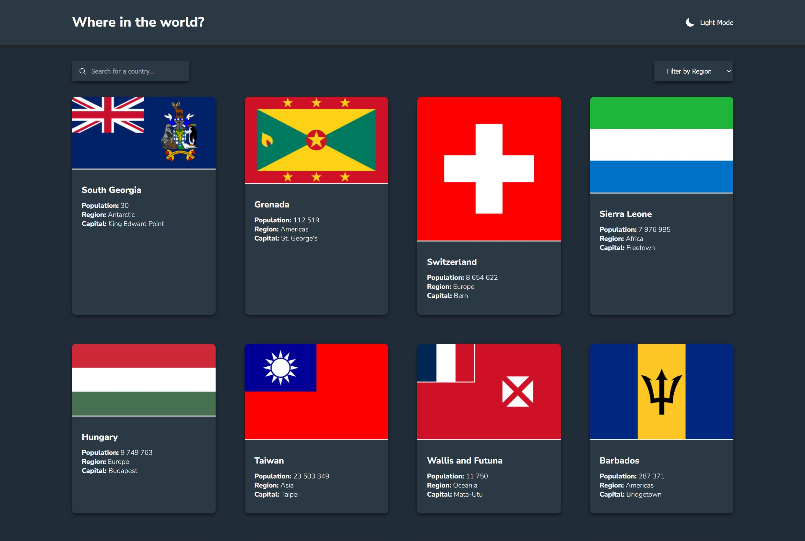
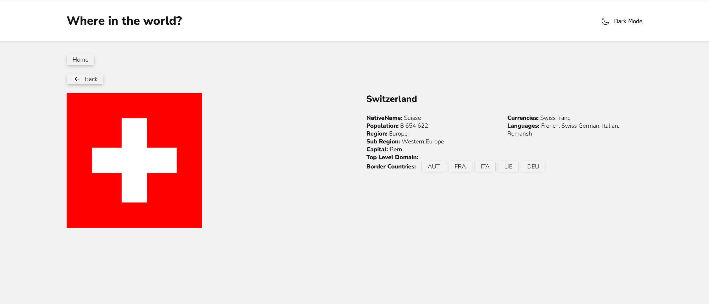

# Countries app

## React + Vite

- single-page application
- REST API

The app was creacted as a challenge prepared by Frontend Mentor.
Additionally, the app uses extra libraries such as:

- react-redux
- reduxjs/toolkit
- react-router

